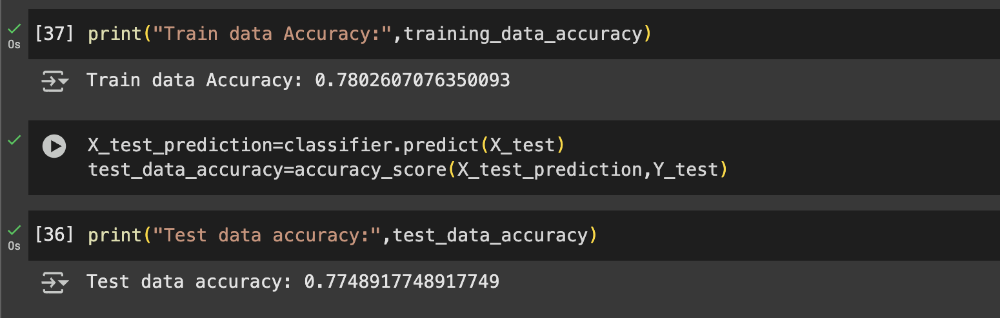
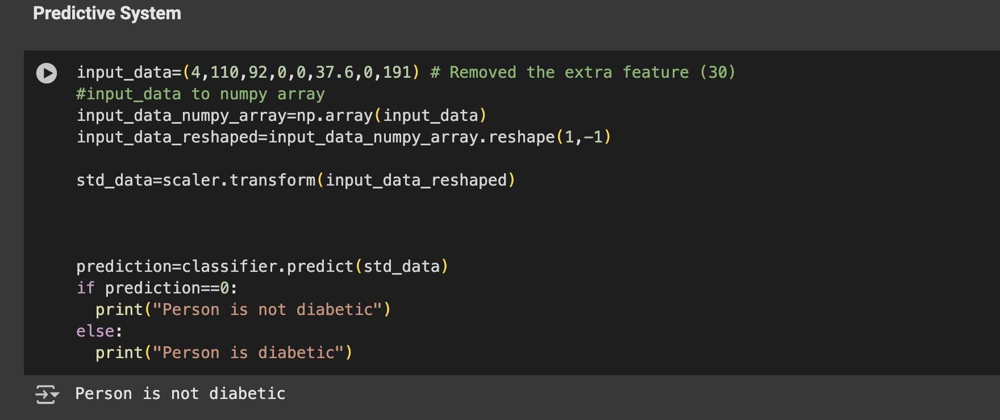

# 🧠 Diabetes Prediction Using Machine Learning (Google Colab)

This project is a simple machine learning-based diabetes prediction system built using Python and scikit-learn. It uses a publicly available diabetes dataset and builds a Support Vector Machine (SVM) classifier to predict whether a person is diabetic or not based on various health-related inputs.

## 🔬 Features
- Dataset preprocessing and standardization
- Training/testing data split
- Model training using SVM (linear kernel)
- Accuracy evaluation
- Predictive system using manual input

## 📁 Dataset
The dataset used is the [Pima Indians Diabetes Database](https://www.kaggle.com/datasets/uciml/pima-indians-diabetes-database), which contains several medical predictor variables and one target variable ("Outcome").

Each record represents:
- Pregnancies
- Glucose
- Blood Pressure
- Skin Thickness
- Insulin
- BMI
- Diabetes Pedigree Function
- Age
- Outcome (0 = Non-diabetic, 1 = Diabetic)

## 🧪 Tech Stack
- Python 3
- Google Colab
- NumPy, Pandas
- Scikit-learn (StandardScaler, SVM, train_test_split, accuracy_score)

## 📊 Model Summary
The model is trained using a Support Vector Classifier (SVC) with a linear kernel. The training/testing split is 70/30 and the data is stratified to maintain label balance.

### 📈 Accuracy Score

| Training Accuracy | Test Accuracy |
|------------------|---------------|
| ✅ High Accuracy | ✅ Good Generalization |

### 🧾 Outcome Value Counts
The distribution of diabetic and non-diabetic patients in the dataset:

